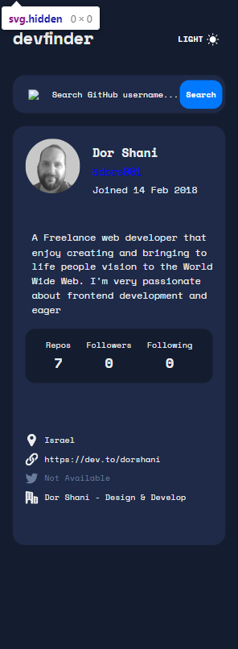
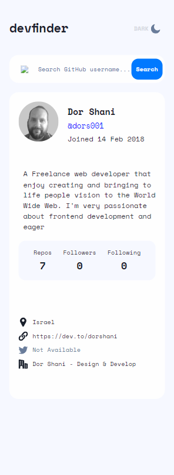
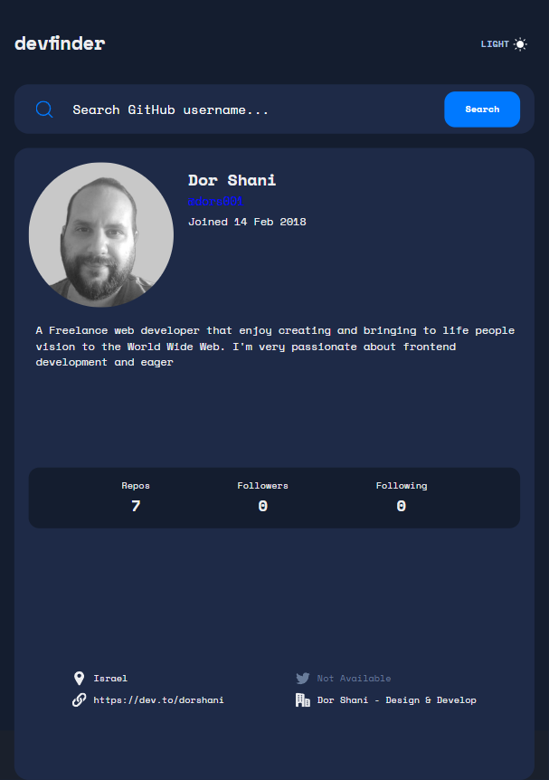
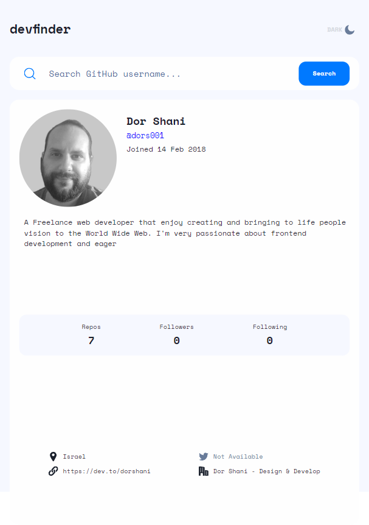
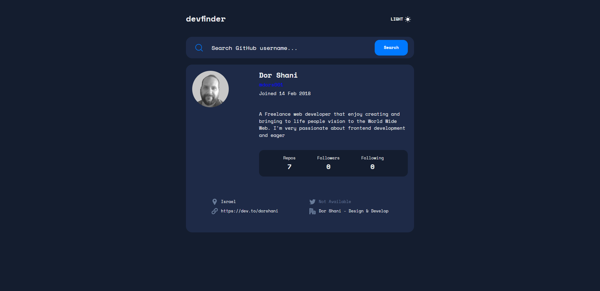
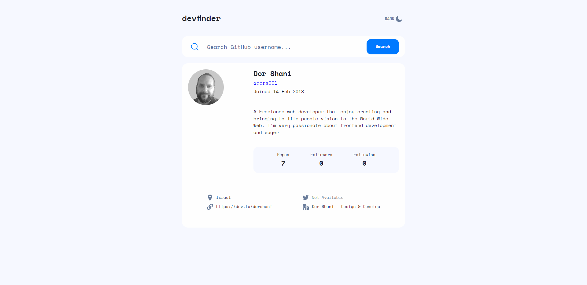

# Frontend Mentor - GitHub user search app solution

This is a solution to the [GitHub user search app challenge on Frontend Mentor](https://www.frontendmentor.io/challenges/github-user-search-app-Q09YOgaH6). Frontend Mentor challenges help you improve your coding skills by building realistic projects.

## Table of contents

- [Overview](#overview)
  - [The challenge](#the-challenge)
  - [Screenshot](#screenshot)
  - [Links](#links)
- [My process](#my-process)
  - [Built with](#built-with)
  - [What I learned](#what-i-learned)
  - [Continued development](#continued-development)
  - [Useful resources](#useful-resources)
- [Author](#author)
- [Acknowledgments](#acknowledgments)

## Overview

### The challenge

Users should be able to:

- View the optimal layout for the app depending on their device's screen size
- See hover states for all interactive elements on the page
- Search for GitHub users by their username
- See relevant user information based on their search
- Switch between light and dark themes
- **Bonus**: Have the correct color scheme chosen for them based on their computer preferences. _Hint_: Research `prefers-color-scheme` in CSS.

### Screenshot

### Links

- Solution URL: [Github](https://github.com/dors001/github-user-search-app)
- Live Site URL: [Github User Search App](https://github-user-search-app-lac-pi.vercel.app/)

## My process

### Built with

- Flexbox
- CSS Grid
- Mobile-first workflow
- [React](https://reactjs.org/)
- [Chakra-UI](https://chakra-ui.com/)

### What I learned

This one was a great fun to do! it gave me a good understanding on how to approach an api integration, while i still have a lot to learn about how to write a cleaner code, it is still a great intruduction to the subject.
I've put a lot more emphasis on creating an initial layout which helped my immensley with setting up the components.

### Continued development

I've realized during this project that i need to create more components, because i worked with components that were just to large to maintain.
Also i need to create a lot more hooks, there were many instances that i needed to manipulate or get data which could be more elegant with a hook.
The road is long but i'm having a blast!

### Useful resources

- [Github API Docs](https://docs.github.com/) - When integrating with Github API the documentation is very useful.

## Author

- Frontend Mentor - [@dors001](https://www.frontendmentor.io/profile/dors001)
